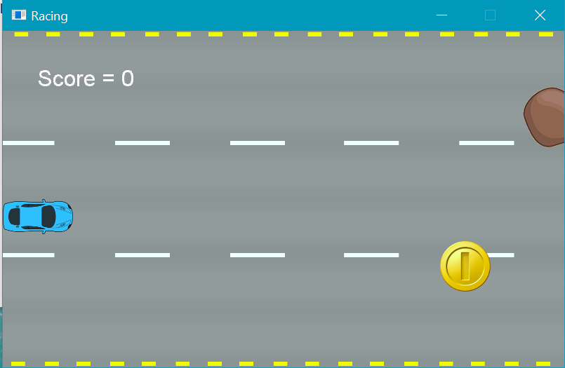

# Racing Game

This is a classical video game. I created it with the help of MonoGame framework. You can play it directly on Windows, or play on other operating system with the installation of Mono environment. 



## Getting Started

### Windows

#### Prerequisites
* Visual Studio or Xamarin

#### Installing
1. Compile the porject in Visual Studio
2. Go to Game1/bin/DesktopGL/x86/Debug, double click Game1.exe

### Mac or Linux
#### Prerequisites
* Mono Framework

#### Installing
1. Compile the porject in Xamarin (or MonoDevelop for Linux)
2. Go to Game1/bin/DesktopGL/x86/Debug, type in terminal with
```
mono Game1.exe
```

## Running the tests

Explain how to run the automated tests for this system

### Break down into end to end tests

1. Player object
2. Background Image
3. Coin object
4. Obstacle object
5. Score system
6. Acceleration system

## Built With
<!--* [C#]() - Programming Language-->
* [Mono](https://github.com/mono/mono) - Compile C# project
* [MonoGame](https://github.com/MonoGame/MonoGame) - Development Framework


## Authors
* **Dauphin Wu** - *Major work for this project* - [Dauphin-NWU](https://github.com/Dauphin-NWU)

<!--See also the list of [contributors](https://github.com/your/project/contributors) who participated in this project.-->

## License

This project is licensed under the MIT License - see the [LICENSE.md](LICENSE.md) file for details

## Acknowledgments

* Hat tip to anyone who's code was used
* Inspiration
* etc

